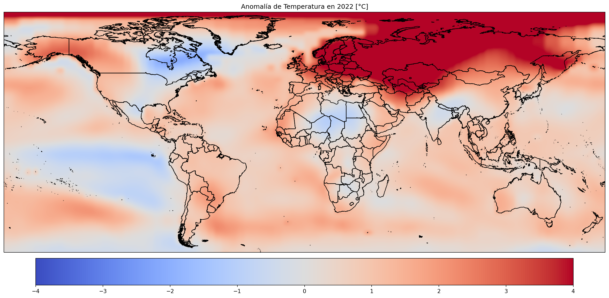

# Datos sobre Anomalías de Temperatura mundial

Anomalías de temperatura desde 1880 con respecto de la media de temperatura en el rango de años 1850-1900, realizando visualizaciones de los mismos. Gracias al [Profesor Ed Hawkins](https://www.linkedin.com/in/edhawkinsclimate/) por el gráfico polar. También se realiza una predicción hasta 2050 con Facebook Prophet.

**Fuentes:** 
+ https://data.giss.nasa.gov/gistemp/
+ https://www.metoffice.gov.uk/hadobs/
+ https://www.ncdc.noaa.gov/cag/global/time-series

[Descarga directa de los datos de anomalías de temperatura (global)](https://www.metoffice.gov.uk/hadobs/hadcrut4/data/current/time_series/HadCRUT.4.6.0.0.monthly_ns_avg.txt)

[Descarga directa de los datos de anomalías de temperatura 2 (global)](https://www.metoffice.gov.uk/hadobs/hadcrut5/)

[Descarga directa de los datos de anomalías de temperatura (mapa)](https://data.giss.nasa.gov/pub/gistemp/gistemp1200_GHCNv4_ERSSTv5.nc.gz)